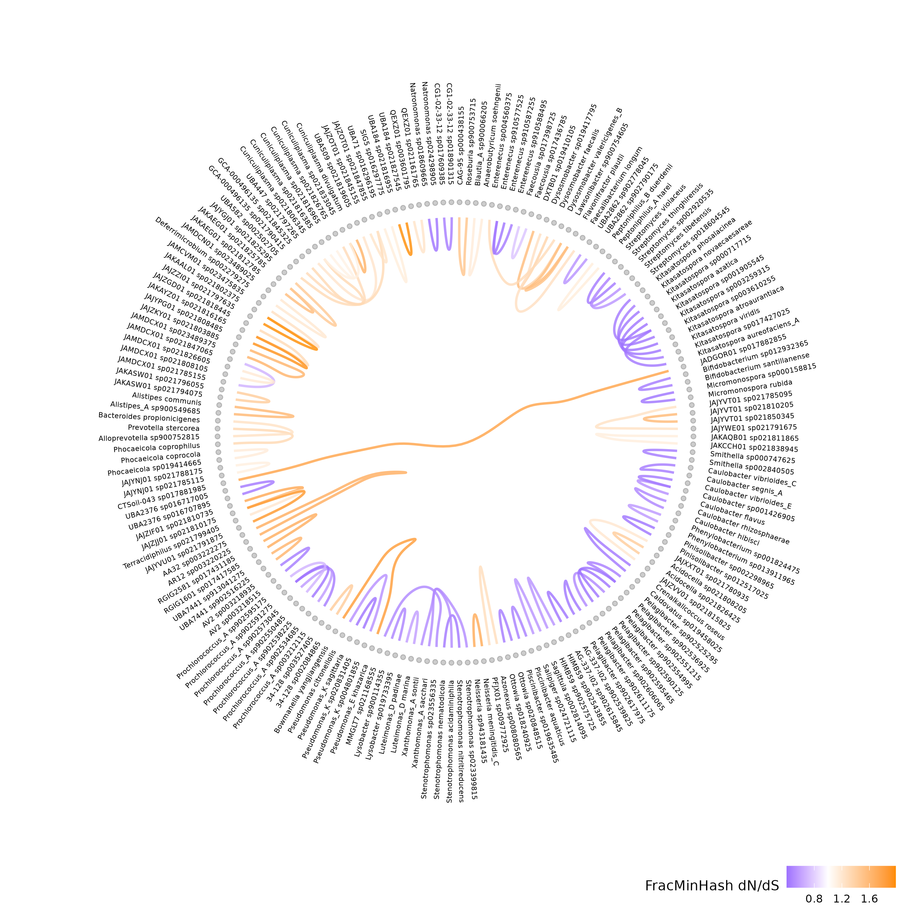

# Hierarchical Edge Bundling of FracMinHash dN/dS (also a dN/dS genomic level estimation)

Hierarchical edge bundling is an easy way to display quantitative pairwise relationships among thousands of genomes [1]. Here, we use the Hierarchical Edge Bundling R Package to present genomic dN/dS estimations between archaeal and bacterial genomes from the Genome Taxonomy Database, where red and blue represent positive and negative selection, respectively. Please find the reproducible script to generate the Hierarchical Edge Bundling Figure presented in manuscript for "Leveraging FracMinHash Containment for Genomic dN/dS". 



# Table of contents

- [Environment setupe](#Environment-Setup)
    - [Conda](#Conda-environment)
    - [Pip](#Pip-environment)
- [Quick start](#Quick-start)
- [Dataset Information](#Dataset-Information)
    - [Taxonomic datasets](#Taxonomic-datasets)
    - [Input](#Input)
- [Usage](#Usage)
    - [Output](#Output)
- [Acknowledgements](#Acknowledgements)
- [References](#References)
- [Our paper](#Our-paper)

# Environment Setup

Create either a conda or pip environment to reproduce this figure.

## Conda environment

```
conda env create -f environment.yml
conda activate hierarchical_env
```

## Pip environment

```
python3 -m venv hierarchical_pip_env
source hierarchical_pip_env/bin/activate
pip install -r requirements.txt
```

# Quick start

Please execute the following script to generate figure:

```Rscript script.r --input fmh_omega_7.csv --taxonomy species```

# Dataset Information

## Taxonomic datasets

This file is to help you out on what the files mean and there purpose. If you have any questions, feel free to reach out!

Download the following files:

```
wget https://data.ace.uq.edu.au/public/gtdb/data/releases/release214/214.0/ar53_taxonomy_r214.tsv
wget https://data.ace.uq.edu.au/public/gtdb/data/releases/release214/214.0/bac120_taxonomy_r214.tsv
```

These files contain taxonomic information of archaeal and bacterial genomes that are used to produce a phylogenetic tree and labels. 

| Column Name | Description |
|---|---|
| NCBI_fasta_name | the identifier also known as an accession number used by ncbi.com |
| custom_fasta_name | a name Judith gave to the sequence based on published data |
| phylum | taxonomic classifier |
| class | taxonomix classifier |
| order | taxonomix classifier |
| family | taxonomix classifier |
| genus | taxonomix classifier |
| species | taxonomix classifier |
| strain | taxonomix classifier |

## Input

We include the a FracMinHash dN/dS result to generate this figure.

**Filename:** fmh_omega_7.csv 

**Purpose:** This file contains the dN/dS values. dN/dS above 1 is postive selection (generally shown in red) and a dN/dS below 1 is negative selection (generally shown in blue). The most important columns here are A, B, and dNdS_ratio_constant.

Note: Currently, this file is not available on the repo, if you plan to run this please reach out to [bioinfwithjudith](https://github.com/bioinfwithjudith).

<!-- Find it here: /data/jzr5814/sourmash_dnds_estimation/for_jinglin/fmh_omega_7.csv -->

| Column Name | Description |
|---|---|
| A | genome A |
| B | genome B |
| containment_nt | containment estimated among nucleotide sequences of genomes A and B |
| ksize | the size of the subsets used for sketching |
| containment_protein | containment estimated among protein sequences of genomes A and B |
| sequence_comparison | comparison between genome name A and B |
| dN_constant | estimated nonsynonymous mutations with constant |
| dS_constant | estimated synonymous mutations with constant |
| dN | estimated nonsynonymous mutations |
| dS | estimated synonymous mutations |
| dNdS_ratio | the estimated dN/dS without constant |
| dNdS_ratio_constant | the estimated dN/dS with constant |

# Usage

You can always find usage instructions here:

```Rscript script.R --help```

| Argument | Description |
|---|---|
| Input | This is a FracMinHash dN/dS csv file |
| Taxonomy | The taxonomy information for species in input file |

## Output

An `output_[taxonomic level].png` file of the figure and a `output_[taxonomic level].csv` with the names of genomes and their pairwise FracMinHash dN/dS estimations will be produced. This is done because the script currently randomly chooses 100 estimations (50 dN/dS estimations < 1 and 50 dN/dS estimations > 1) to be represented in the figure. The blue represents negative selection (dN/dS<1) and the dark orange represents positive selection (dN/dS>1).

<!--
# Demo

Please follow and run jupyter notebook instructions here: [DnDs-visualization/Hierarchical_Edge_Bundling_tree/GTDB/test-code_GTDB copy_jzr_modify.ipynb](https://github.com/KoslickiLab/DnDs-visualization/blob/main/Hierarchical_Edge_Bundling_tree/GTDB/test-code_GTDB%20copy_jzr_modify.ipynb)
-->

# Acknowledgements

Thank you Jinglin Feng for your contributions to this figure!

# References

[1] D. Holten (2006). Hierarchical Edge Bundles: Visualization of Adjacency Relations in Hierarchical Data. IEEE Transactions on Visualization and Computer Graphics, 12(5)

# Our paper

Leveraging FracMinHash Containment for Genomic dN /dS. Judith S. Rodriguez,
Mahmudur Rahman Hera, and David Koslicki. In preparation.

